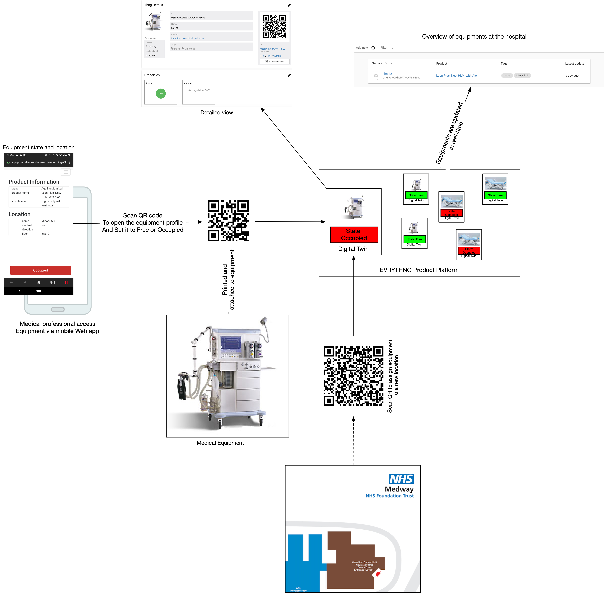
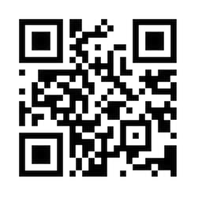

# Hospital Equipment Tracker 

||
|:--:| 
|*Hospital equipment tracker overview*|

We saw in several news reports that hospitals were using spreadsheets to track medical equipment such
as ventilators or free beds. Over a virtual coffee, we came up with the idea to build a hospital equipment tracker 
 using the [EVRYTHNG product cloud](https://dashboard.evrythng.com). The equipment tracker currenlty does three things:
 
 - Register equipment and product type and monitor your hospital in our dashbaord (see [video](https://storage.googleapis.com/hospital-beds-store/docs/videos/dashboard.mov))
 - Track equipment usage and equipment movement using a simple Web app (see [video](https://storage.googleapis.com/hospital-beds-store/docs/videos/mobile-client.mp4))

## Tracking equipment free or in use

||
|:--:| 
|*Web app: scan this QR code to access the page of a ventilator*|

The equipment tracker is entirely Cloud/Web-based and the Web app is accessed by scanning the individual
 QR code (also generated by the EVRYTHNG product cloud)With We wrote a Cloud-based tool to keep track of which equipment is used and where using . 
The app is Web-based. As a medical professional, you launch the Web app for say a ventilator by scanning its
 QR code with your phone.
 
 ## Moving equipment to new location
 
||
|:--:| 
|*Move ventilator to `Sickbay`*|

 If you want to assign a piece of equipment to a new location, first scan the equipment's QR code, 
 then access select `Change Location` and the scan the QR code identifying a location. Usually it would
  be placed visibly on the wall or on a door. 
  
||
|:--:| 
|*Move ventilator to `Minor S&S`*|  

  Before you keep reading, please move th4 ventilator back to Minor S&S
  

## interested? Here is what you need to do

Once:

- Send [me](mailto:joel@evrythng.com) an email with a list (Excel, csv)  of which equipments you'd like to track and all possible locations. I'll automate this once I have a better understanding of how equipment and locations are described within hospitals.
- Download equipment QR codes `https://equipment-tracker-dot-machine-learning-238812.appspot.com//hospitals/{hospital_name}/equipments`. You'll get pages of QR codes, which you will print and tape to your equipment.
- Same procedure but with locations `https://equipment-tracker-dot-machine-learning-238812.appspot.com//hospitals/{hospital_name}/locations`
- Create a free EVRYTHNG account and send me your user email. I'll invite you to your project in my account, which has advanced privileges.

Continuously:

- Every time equipment is used or freed, scan its QR code and change it's state
- If you'd like to know where things are, assign equipment to places within your hospital when equipment is moved.
- Monitor your equipment in our dashboard. If you fancy coding, [you can easily export your data and create your own reports or webpages](http://developers.evrythng.com)  

 